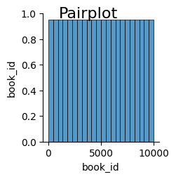

# Detailed Analysis Narrative

## Data Description
The dataset comprises **10,000 books** with **23 features**. Key attributes include:

- **Identifiers**: `book_id`, `goodreads_book_id`, `best_book_id`, `work_id`
- **Books Details**: `authors`, `original_title`, `title`, `language_code`, `isbn`, `isbn13`, `image_url`, `small_image_url`
- **Publishing Info**: `original_publication_year`, `books_count`
- **Rating Information**: `average_rating`, `ratings_count`, `work_ratings_count`, `work_text_reviews_count`, and detailed breakdowns of ratings (1-5).

Notably, there are several **missing values** across various fields (e.g., `isbn` - 700 missing, `isbn13` - 585 missing), which suggests potential issues in data collection or mergers.

## Trends
Several trends emerge from the dataset:

1. **Average Rating**: The mean average rating across books is approximately **4.00**. This suggests a generally positive reception but requires a closer look at distribution due to the potential impact of skewed ratings.

2. **Publication Years**: The original publication year trend indicates a focus on relatively recent publications (mean: 1981.99). The variability (std: 152.57) suggests a wide range of publication years.

3. **Rating Distribution**: The data shows a significant number of ratings clustered around higher values, evidenced by high means for ratings counts (i.e., `ratings_5` mean is **23,789.81**). This trend suggests a preference for better-rated books.

4. **Outlier Presence**: Certain fields, such as `work_text_reviews_count` and all `ratings` categories, exhibit extremely high values, indicating that some books have garnered significant attention compared to others.

## Anomalies
Anomalies within the data provide several insights:

1. **Missing Values**: A high number of missing values in `isbn`, `isbn13`, and `language_code` suggests gaps that may hinder data analysis or model building.

2. **Outliers Detected**:
   - Fields like `average_rating` show anomalies with incredibly high values (e.g., 158), which are implausible and need further investigation.
   - The `isbn`, `goodreads_book_id`, and `book_id` also contain outliers that can skew results if not addressed (e.g. `goodreads_book_id` maximal value is **33,288,638**).

3. **Anomalous Ratings**: The extreme count of ratings in the 1-5 scale highlights potential issues in user behavior or fraudulent activity (e.g., some books have ratings counts exceeding **450,000**).

## Correlations
Key correlations in the dataset indicate:

- **Positive Correlation**:
  - There are strong correlations between `ratings_count` and `work_ratings_count` (0.995), showing that higher book ratings consistently lead to higher overall ratings for the work.
  - The relationship between different rating categories (e.g., `ratings_1` to `ratings_5`) is significant, indicating that books receiving multiple ratings follow a predictable pattern.

- **Negative Correlation**:
  - The inverse correlations exist between `books_count` and various rating fields (e.g., `ratings_count` at -0.373). This suggests that a higher count of books attributed to an author does not directly translate to higher average ratings or counts of ratings.

## Recommendations
To improve data quality and insights, the following recommendations are proposed:

1. **Data Cleaning**: Focus on addressing missing values, particularly in `isbn`, and investigate anomalies in ratings and reviews to ensure data integrity.

2. **Outlier Analysis**: Conduct a thorough examination of outliers within rating fields to determine their origin and whether to remove or adjust these entries for analysis.

3. **Feature Engineering**: Consider creating additional features that combine existing data, such as average ratings per author or time since publication relative to average ratings.

4. **User Behavior Analysis**: Implement deeper analytics on user interactions to monitor for suspicious patterns in ratings and reviews, particularly for books with extremely high counts.

## Insights
- **Reader Behavior**: The patterns in ratings suggest that readers tend to favor well-rated books, and these preferences could influence marketing strategies for authors or publishers.
- **High Engagement Books**: Notably, some books attract significantly more ratings than others, indicating potential best-sellers or popular titles within specific genres.

## Implications
The findings indicate a trend where exceptional books are rewarded with high ratings, while less impactful works may struggle to gain traction. This poses implications for authors and publishers on strategic releases and marketing efforts to boost visibility and engagement.

## Conclusion
The dataset provides a rich source for understanding trends in book ratings and reader preferences. However, attention must be directed towards anomalies and missing data to ensure conclusions drawn from the analysis are robust. Future actions should emphasize data quality and investigate user behavior patterns to derive actionable strategies that can benefit authors and publishers alike.

