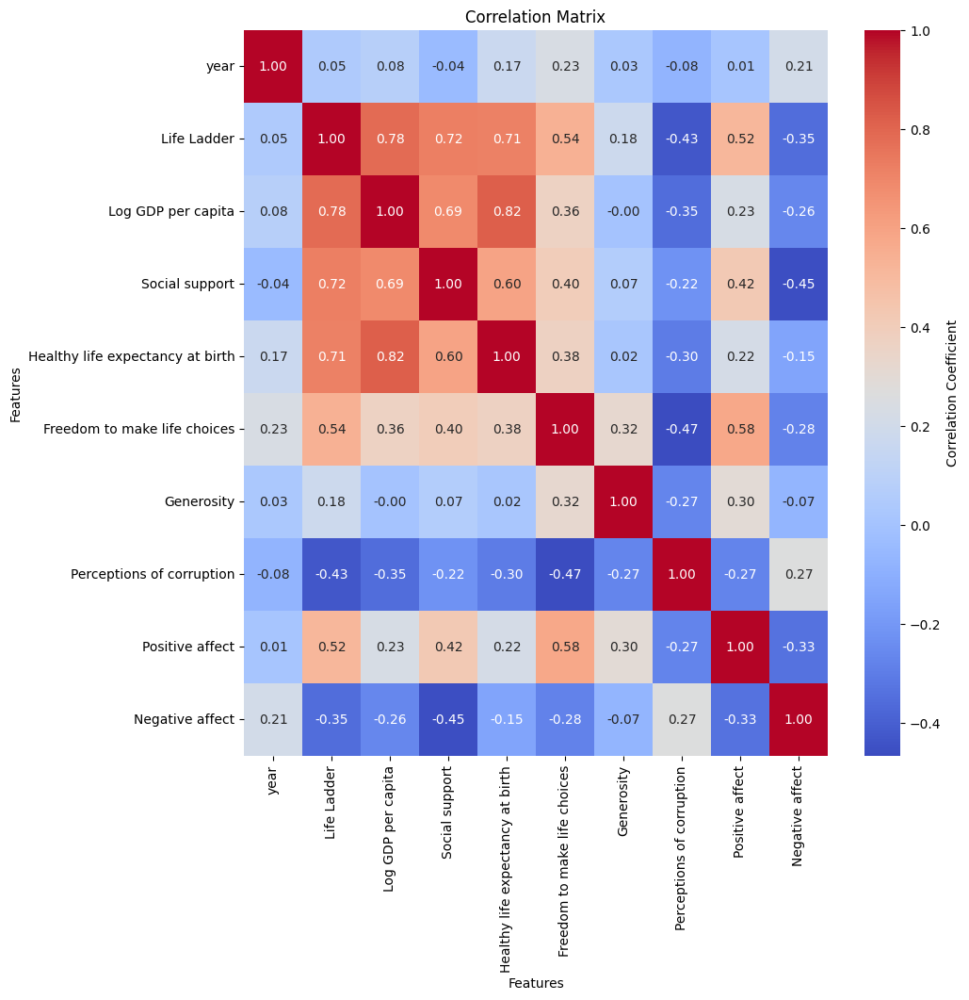
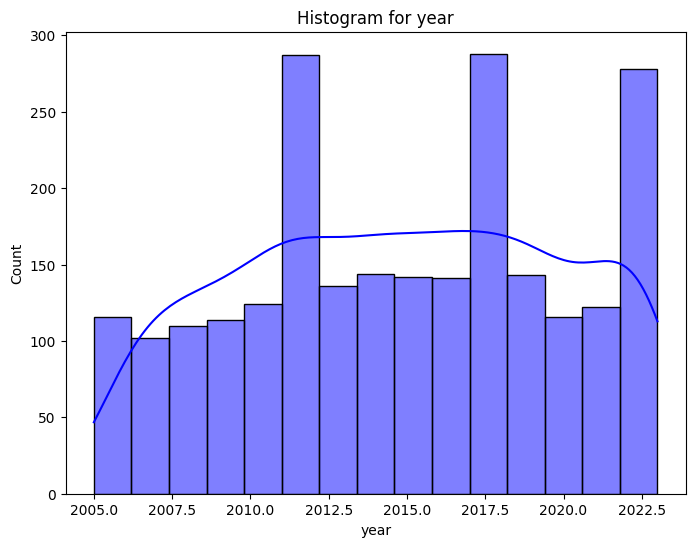
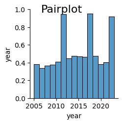

# Detailed Analysis Narrative

### Data Description
The dataset comprises **2,363 rows and 11 columns**, capturing various aspects of well-being across different countries and years. Key columns include:

- **Country Name**: Denotes the country being analyzed.
- **Year**: Indicates the year of the data point, spanning from **2005 to 2023**.
- **Life Ladder**: A metric representing perceived well-being, scored between **1.281 and 8.019**.
- **Log GDP per capita**: A logarithmic transformation of GDP per capita, ranging from **5.527 to 11.676**.
- **Social Support**: Scores indicating the perceived level of support.
- **Healthy Life Expectancy at Birth**: The average number of years a newborn is expected to live in good health.
- **Freedom to Make Life Choices**: Scores reflecting individual autonomy.
- **Generosity**: Indicates generosity levels among the population, with a notable presence of missing values.
- **Perceptions of Corruption**: Scores that reflect people's views on corruption.
- **Positive and Negative Affect**: Metrics revealing emotional well-being.

The analysis reveals several **missing values** across metrics, most notably in **Generosity** (81 missing entries), followed by **Perceptions of Corruption** (125 missing entries). All other fields exhibit minimal missing data.

### Trends
Various trends can be observed in the data:

- **Life Ladder**: The mean score is approximately **5.48**, indicating a moderate level of perceived well-being. The **interquartile range** (IQR) suggests a relatively compact distribution of well-being perceptions across countries.
- **Log GDP per capita**: Higher values correlate positively with life satisfaction, with the mean being **9.40**, indicative of overall economic status.
- **Social Support** and **Healthy Life Expectancy** are positively skewed, with means of **0.81** and **63.40 years**, respectively, suggesting a trend toward overall societal and health well-being.
- **Perceptions of Corruption** exhibit variability, with an average score around **0.74**, inferring moderate perceptions among global populations regarding corruption.

### Anomalies
The analysis highlights several anomalies particularly in:

- **Social Support**: An outlier count of **48** suggests extreme values, potentially reflecting either very high or very low perceived support in certain countries.
- **Generosity**: With **39 outliers**, this indicates significant variance in giving behavior across countries.
- The **Healthy Life Expectancy** shows **20 outliers**, hinting at countries with either exceptionally high or low health standards.
- The **Log GDP per capita** and **Life Ladder** also display a limited number of outliers (1 and 2, respectively), centering most countries within expected ranges.

### Correlations
Correlations reveal several interesting relationships:

- The strongest correlation is between **Log GDP per capita** and **Life Ladder** (**0.78**), indicating that wealthier countries generally report higher life satisfaction.
- **Social Support** also correlates with **Life Ladder** (**0.72**) and **Healthy Life Expectancy** (**0.60**), pointing to the significance of communal networks in enhancing well-being.
- A notable negative correlation exists between **Perceptions of Corruption** and **Life Ladder** (**-0.43**), suggesting that higher perceived corruption correlates with lower life satisfaction.
- The **Negative Affect** score displays a moderate positive correlation with **year** (**0.21**), indicating growing distress or dissatisfaction over time.

### Recommendations
Based on the findings, several key recommendations arise:

1. **Focus on Social Support Programs**: Countries with lower social support scores should invest in community-building initiatives, potentially enhancing life satisfaction.
   
2. **Address Corruption**: Nations exhibiting high perceptions of corruption need transparency and governance reforms to build trust among their populations.

3. **Monitor Economic Growth**: Given the strong correlation between economic growth and life satisfaction, governments should implement policies fostering sustainable economic development.

4. **Health Interventions**: Countries with low healthy life expectancy ought to prioritize healthcare and wellness programs to improve overall health outcomes.

### Insights
The data indicates a clear interrelationship between economic prosperity, social support, and individual well-being. Moreover, the troubling perception of corruption creates an environment of distrust, adversely affecting life satisfaction.

### Implications
The implications of these findings extend to policymakers and stakeholders:

- Investments in social infrastructure can positively impact health and happiness.
- Addressing corruption should be a priority as it appears to influence not only governance but quality of life as well.
- Ongoing monitoring and analysis of these metrics can help track progress and highlight areas needing urgent attention.

### Conclusion
The dataset offers valuable insights into the intertwined facets of economic, social, and individual well-being across nations. The strong correlations observed between different variables advocate for holistic approaches to policy-making, emphasizing support systems and anti-corruption measures as essential pathways to enhance life satisfaction globally.

