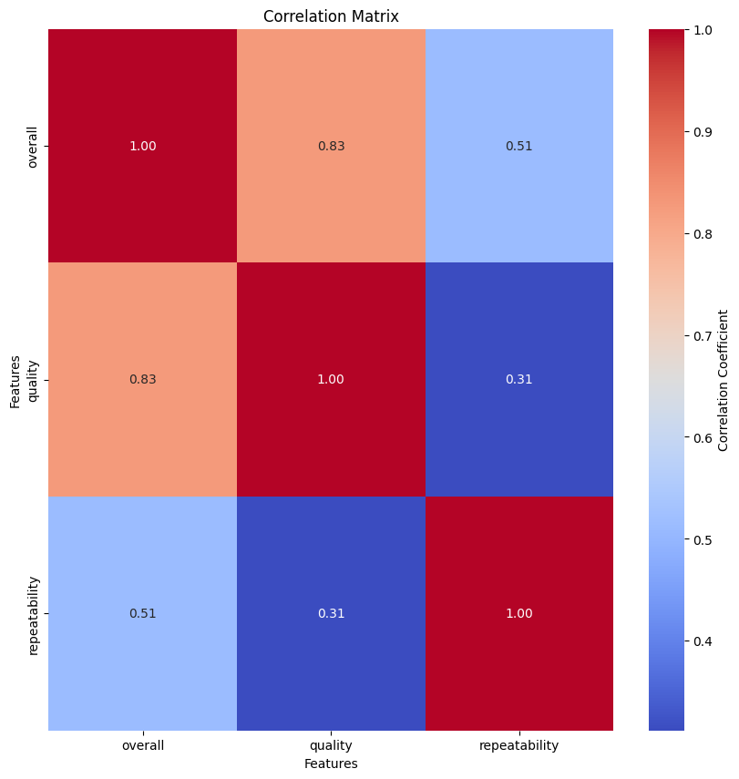
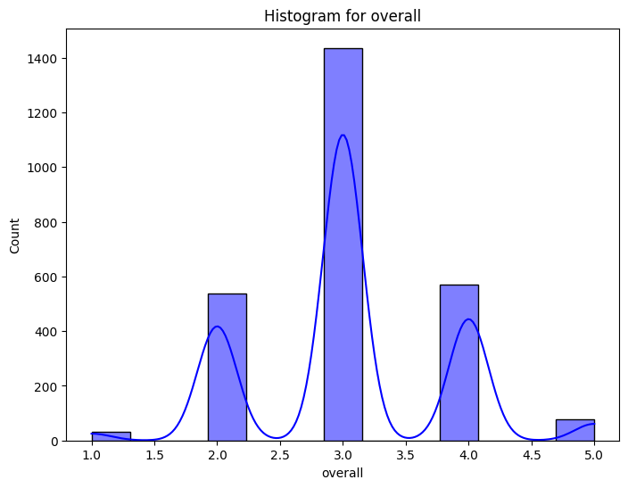
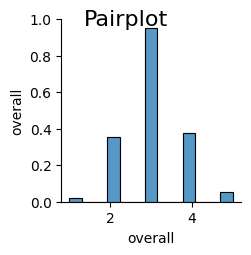

# Detailed Narrative Report

## Data Description
The dataset consists of **2,652 records** with **8 columns**. The data types indicate a mix of categorical and numerical values:
- **Date**: Object
- **Language**: Object
- **Type**: Object
- **Title**: Object
- **By**: Object
- **Overall**: Integer (overall rating)
- **Quality**: Integer (quality rating)
- **Repeatability**: Integer (repeatability rating)

### Missing Values
The dataset contains missing values, particularly in the `date` (99 missing) and `by` columns (262 missing). Notably, all other fields do not have missing data.

### Summary Statistics
- **Overall Rating**: 
  - Mean: 3.05 (on a scale of 1 to 5)
  - Skewness: 0.16 (indicating a slight right tail)
- **Quality Rating**: 
  - Mean: 3.21
  - Skewness: 0.02 (suggesting a symmetrical distribution)
- **Repeatability**: 
  - Mean: 1.49 
  - Skewness: 0.78 (indicating a positive skew, suggesting more ratings at lower values)

## Trends
1. **Overall and Quality Ratings**: The average ratings for both overall (3.05) and quality (3.21) suggest a generally positive perception, though there is a notable concentration of data around lower values, as indicated by the skewness.
  
2. **Repeatability**: The average repeatability score is low (1.49), indicating that most observations rate the repeatability aspect at the lower end of the scale. The maximum value observed is 3, emphasizing potential issues in consistency across records.
  
3. **Outliers**: The count of outliers is significant in the overall ratings (1216 out of 2652), suggesting a substantial variance in how different instances are rated.

## Anomalies
Anomalies in the dataset, represented by the output `[-1, 1, -1, ..., 1, 1, 1]`, suggest the presence of distinct patterns or irregularities in the classifications or ratings. The negative values indicate ratings significantly below the expected or overall average, highlighting areas that may need closer examination for potential improvement.

## Correlations
The correlation analysis shows strong relationships between various metrics:
- **Overall and Quality Ratings**: High correlation (0.826), suggesting that higher overall ratings are typically associated with higher quality ratings.
- **Overall and Repeatability Ratings**: Moderate correlation (0.513), indicating that improvements in how repeatability is perceived might positively impact overall ratings.
- Cramér’s V statistics show *very strong relationships* between certain categorical variables, such as:
  - Language and Title: **0.996**
  - Type and Title: **0.987**
  
These high values indicate a strong dependency between these categorical variables, which could be exploited for further analysis and recommendations.

## Recommendations
1. **Address Missing Values**: Develop a strategy for handling the 99 missing `date` values and the 262 missing `by` values. This could involve imputation or removal of impacted records based on context.
  
2. **Review Outliers**: Examine the 1216 outliers in the overall ratings to identify common characteristics and potential data entry issues. Modifying these ratings might enhance the overall analysis.

3. **Enhance Repeatability**: Since the repeatability score is low, investigate underlying factors contributing to these ratings and consider ways to enhance the consistency of the experiences being measured.

4. **Leverage Correlations**: Use the strong correlations between language, type, and title classifications to tailor data-driven strategies for varying segments identified in the dataset. 

## Insights
- The skewness and kurtosis of the overall and repeatability ratings suggest a potential bias in how items are being rated, possibly indicating areas needing attention or further qualitative exploration.
- The presence of strong Cramér’s V statistics indicates potential underlying categories in the data that could enhance predictive modeling if properly understood.

## Implications
The findings raise important questions regarding the consistency of ratings and their impact on overall perceptions of quality. Organizations should consider how varying factors might influence ratings and how to standardize experiences to cultivate repeatability and satisfaction.

## Conclusion
Overall, the dataset presents valuable insights into the perceptions and ratings of various instances. By addressing missing values, investigating outliers, and utilizing strong correlations, stakeholders can enhance both the interpretability and applicability of the data. Ultimately, these actions can lead to improved consistency and quality, impacting overall satisfaction positively. The recommendations listed in this report provide a roadmap for further analysis and sustained improvement in future activities.

